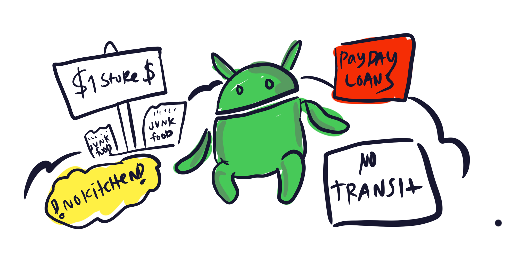

# First Android Project

It's time to get around to doing a first android project. Since Android is the phone of choice for many struggling, low income and even homeless Americans, an Android app around being homeless might be a cool first idea for this demographic!

This isn't my biggest priority but it will be fun to try out React Native, etc. and spin off something good for low-income Americans.

# Problems Homeless People have in America
* Safety
* Safe place to sleep at night
  * Shelter space
  * Tent
  * RV / Car
  * Friends 
* Stress 
* Places to charge their phone
* Internet Connection
* Keeping your job (at least 30% of homeless in the USA are employed full time?) maybe even more in SF
* Finding a job
* Showering
* Being a homeless child
* it's more expensive to be poor than rich problems
  * Can't get bank accounts
    * Payday loan expenses 
  * No kitchens to cook food
    * Food is more expensive
    * Food is unhealthy unless you are rich  